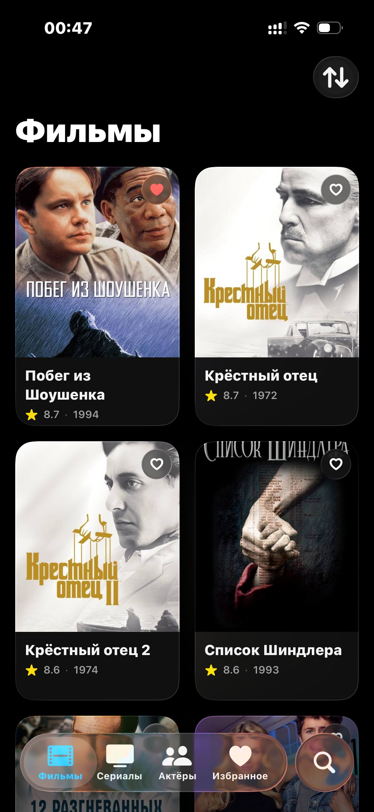
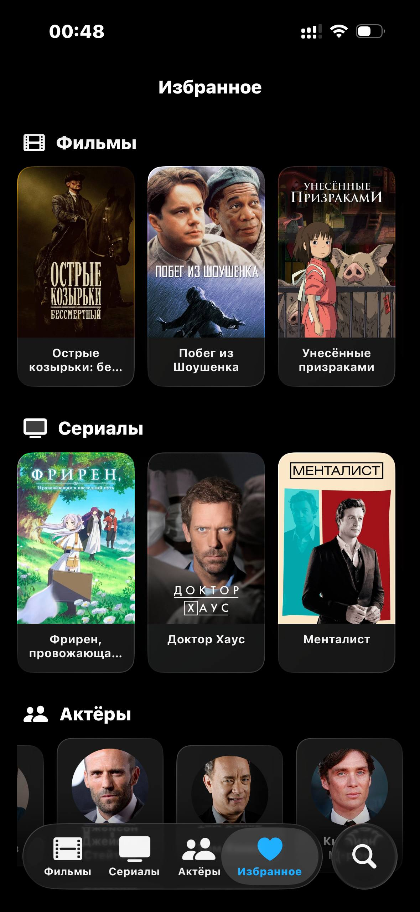

Simple IOS app to list newest movies check ratings etc.

Used free API from MoviesDB.

If you want to build it by yourself you'll need to generete your own API key.

I've tried to achieve some apple like ui/ux design
Apple original guidline was took as reference

Now working: 
1.Fetching images, movie data.
2.Sorting top_rated, popular, new.
3.Search
4.Liked content and categorised in Favorites tab.
5.Liquid glass fresh sdk all content on screen
6.Idk all working so good, seem's like i worked well!

Some screenshots here:
## Screenshots

  
  
